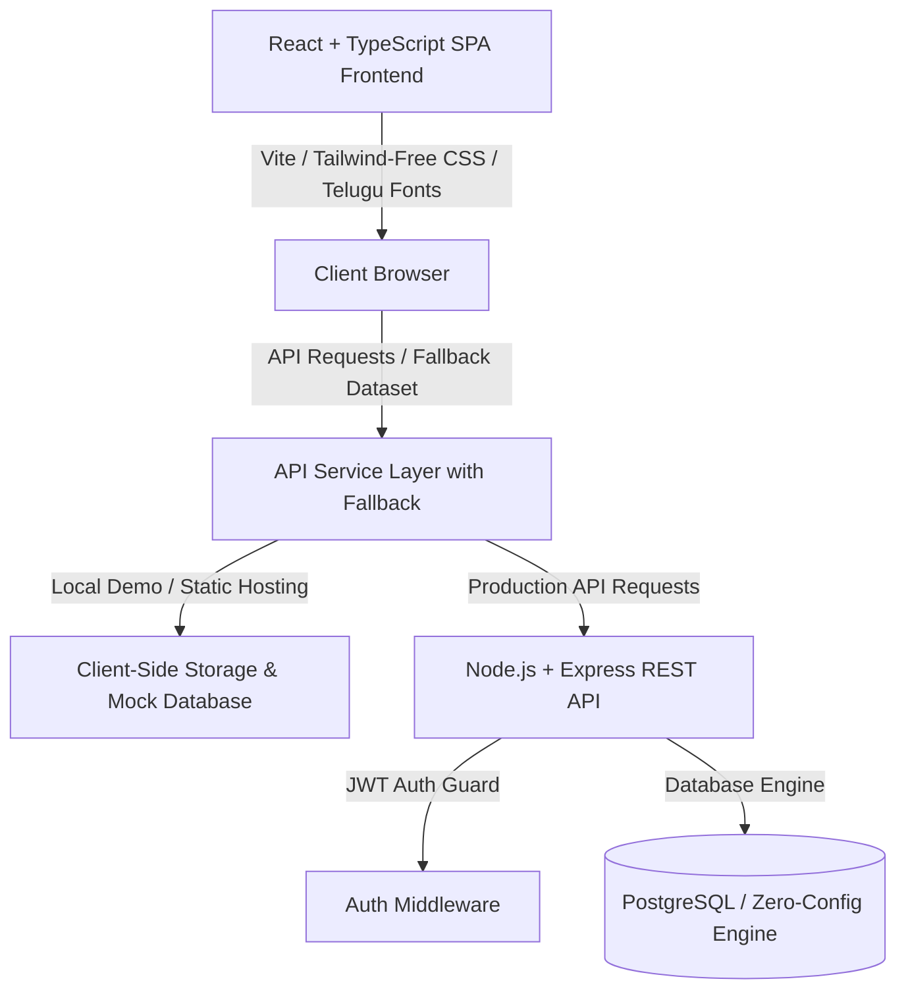

# 🌶️ ASHOK PICKLES — Authentic Traditional Indian Pickles & Pachadi

> **Handcrafted Authentic Taste. Cold-Pressed Virgin Sesame & Mustard Oils. FSSAI Certified. Delivered To Your Door Across India.**

ASHOK PICKLES is a dedicated, production-ready, mobile-first e-commerce web platform engineered for authentic Andhra and Telangana traditional handcrafted pickles (Achar, Pachadi). Featuring 30 authentic varieties (15 Vegetarian + 15 Non-Vegetarian) with bilingual English and Telugu script typography, real-time spice heat index, multi-variant weights (250g, 500g, 750g, 1kg), clean original pricing, dedicated sign-in experience, and responsive 4-column catalog.

---

## 🏛️ System Architecture



---

## 🚀 Key Features

### 🛒 Customer Storefront
- **30 Authentic Pickle Varieties**:
  - **15 Vegetarian Pickles**: Avakaya (ఆవకాయ), Gongura Pachadi (గోంగూర పచ్చడి), Magaya (మాగాయ), Dosakaya (దోసకాయ పచ్చడి), Gongura Garlic (గోంగూర వెల్లుల్లి), Lemon (నిమ్మకాయ), Amla (ఉసిరికాయ), Green Chilli (పచ్చిమిరపకాయ), Pandu Mirapakaya (పండు మిరపకాయ), Tomato (టమాటా), Tamarind (చింతకాయ), Garlic (వెల్లుల్లి), Mango Thokku (మామిడికాయ తొక్కు), Brinjal (వంకాయ), Dondakaya (దొండకాయ).
  - **15 Non-Vegetarian Pickles**: Chicken Pickle (చికెన్ పచ్చడి), Mutton Pickle (మటన్ పచ్చడి), Prawn Pickle (రొయ్యల పచ్చడి), Fish Pickle (చేపల పచ్చడి), Chicken Gongura (చికెన్ గోంగూర), Mutton Gongura (మటన్ గోంగూర), Gongura Prawn (గోంగూర రొయ్యల), Chicken Garlic (చికెన్ వెల్లుల్లి), Mutton Garlic (మటన్ వెల్లుల్లి), Garlic Prawn (వెల్లుల్లి రొయ్యల), Gongura Fish (గోంగూర చేపల), Dry Fish (ఎండు చేపల), Dry Prawn (ఎండు రొయ్యల), Crab Pickle (పీతల పచ్చడి), Chicken Liver Pickle (చికెన్ లివర్).
- **Interactive Veg / Non-Veg Toggle**: Filter easily between 100% Vegetarian and Authentic Non-Vegetarian specialties.
- **4 Selectable Weight Packs**: 250g, 500g, 750g, and 1kg with live pricing updates.
- **Spice Heat Rating**: Out of 5 with visual red chilli indicators (`🌶️🌶️🌶️🌶️🌶️`).
- **Dedicated Sign-In Interface**: Clean, professional login page without demo clutter.
- **Serviceable Indian PIN Code Checker**: Live verification across India with free delivery above ₹499.
- **Universal Static Hosting Support**: Works seamlessly both locally with Express backend and globally as a static website on GitHub Pages / Vercel.

---

## 🌐 Deploy to GitHub & Share Public Link

### Option A: Automatic GitHub Pages Deployment (Free & Included)

1. Create a new repository on GitHub:
   - Go to [https://github.com/new](https://github.com/new)
   - Enter repository name: `ashok-pickles`
   - Choose **Public**
   - Do **NOT** check README or .gitignore (we already have them)
   - Click **Create repository**

2. Run the following commands in the `pickels` folder:
   ```bash
   git remote add origin https://github.com/YOUR_GITHUB_USERNAME/ashok-pickles.git
   git branch -M main
   git push -u origin main
   ```

3. Enable GitHub Pages:
   - On GitHub, go to your repository **Settings** ➔ **Pages** (under Code and automation).
   - Under **Build and deployment > Source**, select **GitHub Actions**.
   - Your site will automatically build and publish to:
     `https://YOUR_GITHUB_USERNAME.github.io/ashok-pickles/`
   - Share this link with your friends!

---

### Option B: Deploy in 1-Click with Vercel (Free & Instant)

1. Go to [https://vercel.com/new](https://vercel.com/new)
2. Sign in with GitHub and select your `ashok-pickles` repository.
3. Set **Root Directory** to `frontend`.
4. Click **Deploy**.
5. You will get an instant public URL (e.g. `https://ashok-pickles.vercel.app`) to share with friends!

---

## 🏃 Running Locally

### 1. Install Dependencies
```bash
npm install
cd frontend && npm install
cd ../backend && npm install
```

### 2. Start Both Frontend & Backend
```bash
# Terminal 1 (Backend API on http://localhost:5001)
cd backend && npm run dev

# Terminal 2 (Frontend App on http://localhost:5173)
cd frontend && npm run dev
```

---

## 🔒 Food Safety & Compliance
- **FSSAI License**: 10021042000889
- **Oils**: 100% Wood-Pressed Virgin Sesame & Mustard Oil
- **Spices**: Stone-ground Guntur & Warangal chillies, unadulterated rock salt
