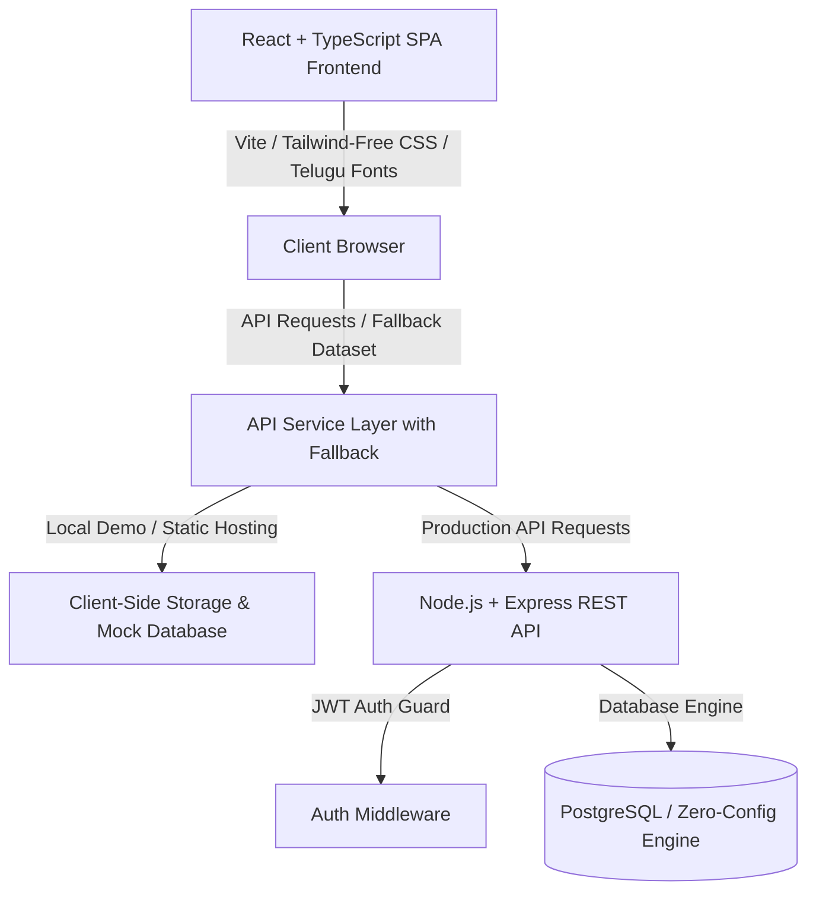

# 🌶️ ASHOK PICKLES — Authentic Traditional Indian Pickles & Pachadi

> **Handcrafted Authentic Taste. Cold-Pressed Virgin Sesame & Mustard Oils. FSSAI Certified. Delivered To Your Door Across India.**

### 🔗 Live Links:
- 🌐 **Live Website (GitHub Pages)**: [https://gunnalakshmi.github.io/pickels/](https://gunnalakshmi.github.io/pickels/)
- 💻 **GitHub Repository**: [https://github.com/Gunnalakshmi/pickels](https://github.com/Gunnalakshmi/pickels)

---

ASHOK PICKLES is a dedicated, production-ready, mobile-first e-commerce web platform engineered for authentic Andhra and Telangana traditional handcrafted pickles (Achar, Pachadi). Featuring the signature 7 handcrafted pickle varieties with bilingual English and Telugu script typography, high-definition jar photography, real-time spice heat index, multi-variant weights (250g, 500g, 750g, 1kg), clean original pricing, dedicated sign-in experience, and responsive 4-column catalog.

---

## 🏛️ System Architecture


```mermaid
graph TD
    Client[React + TypeScript SPA Frontend] -->|Vite / Tailwind-Free CSS / Telugu Fonts| Browser[Client Browser]
    Browser -->|API Requests / Fallback Dataset| Service[API Service Layer with Fallback]
    Service -->|Local Demo / Static Hosting| LocalStorage[Client-Side Storage & Mock Database]
    Service -->|Production API Requests| Backend[Node.js + Express REST API]
    Backend -->|JWT Auth Guard| AuthMW[Auth Middleware]
    Backend -->|Database Engine| DB[(PostgreSQL / Zero-Config Engine)]
```

---

## 🚀 Key Features

### 🛒 Handcrafted Pickle Catalog (7 Signature Varieties)
1. **ఏలకాయ పచ్చడి (Elakay Pachadi)** — Rare cardamom pod delicacy crafted with cold-pressed oil & stone-ground spices.
2. **బీరకాయ పచ్చడి (Beerakaya Pachadi)** — Traditional Andhra ridge gourd peel roasted with green chillies & roasted sesame.
3. **మునగ ఆకు పచ్చడి (Munaga Aaku Pachadi)** — Nutrient-dense moringa leaf pachadi packed with iron and roasted lentils.
4. **కరివేపాకు పచ్చడి (Karivepaku Pachadi)** — Fresh curry leaves roasted with black gram, red chillies & tamarind.
5. **కాకరకాయ పచ్చడి (Kakarakaya Pachadi)** — Crispy bitter gourd slow-roasted to balance bitterness with tangy spices.
6. **మామిడి పచ్చడి (Mamidi Pachadi)** — Classic Andhra raw mango pachadi with stone-ground mustard & sun-ripened red chillies.
7. **చికెన్ పచ్చడి (Chicken Pachadi)** — Boneless country chicken simmered in rich Telugu spice gravy with aromatic cloves.

- **Interactive Veg / Non-Veg Toggle**: Filter easily between 6 Vegetarian and 1 Authentic Non-Vegetarian specialty.
- **4 Selectable Weight Packs**: 250g, 500g, 750g, and 1kg with live pricing updates.
- **Spice Heat Rating**: Out of 5 with visual red chilli indicators (`🌶️🌶️🌶️🌶️🌶️`).
- **Dedicated Sign-In Interface**: Clean, professional login page without demo clutter.
- **Serviceable Indian PIN Code Checker**: Live verification across India with free delivery above ₹499.
- **Universal Static Hosting Support**: Works seamlessly both locally with Express backend and globally as a static website on GitHub Pages.

---

## 🌐 Deploy to GitHub & Share Public Link

### Option A: Automatic GitHub Pages Deployment (Free & Included)

1. Create a new repository on GitHub:
   - Go to [https://github.com/new](https://github.com/new)
   - Enter repository name: `ashok-pickles`
   - Choose **Public**
   - Do **NOT** check README or .gitignore (we already have them)
   - Click **Create repository**

2. Run the following commands in the `pickels` folder:
   ```bash
   git remote add origin https://github.com/YOUR_GITHUB_USERNAME/ashok-pickles.git
   git branch -M main
   git push -u origin main
   ```

3. Enable GitHub Pages:
   - On GitHub, go to your repository **Settings** ➔ **Pages** (under Code and automation).
   - Under **Build and deployment > Source**, select **GitHub Actions**.
   - Your site will automatically build and publish to:
     `https://YOUR_GITHUB_USERNAME.github.io/ashok-pickles/`
   - Share this link with your friends!

---

### Option B: Deploy in 1-Click with Vercel (Free & Instant)

1. Go to [https://vercel.com/new](https://vercel.com/new)
2. Sign in with GitHub and select your `ashok-pickles` repository.
3. Set **Root Directory** to `frontend`.
4. Click **Deploy**.
5. You will get an instant public URL (e.g. `https://ashok-pickles.vercel.app`) to share with friends!

---

## 🏃 Running Locally

### 1. Install Dependencies
```bash
npm install
cd frontend && npm install
cd ../backend && npm install
```

### 2. Start Both Frontend & Backend
```bash
# Terminal 1 (Backend API on http://localhost:5001)
cd backend && npm run dev

# Terminal 2 (Frontend App on http://localhost:5173)
cd frontend && npm run dev
```

---

## 🔒 Food Safety & Compliance
- **FSSAI License**: 10021042000889
- **Oils**: 100% Wood-Pressed Virgin Sesame & Mustard Oil
- **Spices**: Stone-ground Guntur & Warangal chillies, unadulterated rock salt
